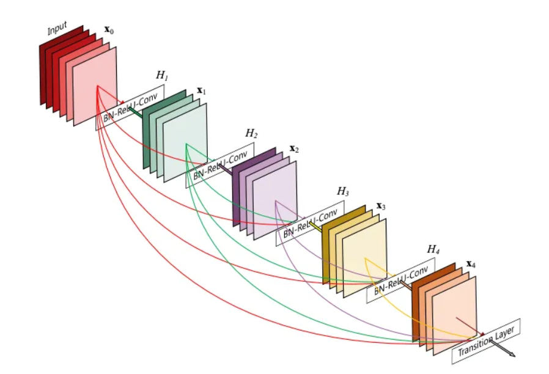
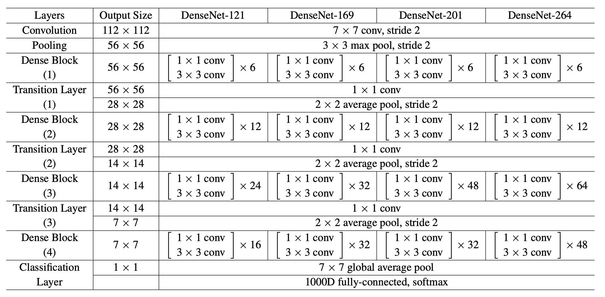

# DenseNet (169 layers)
DenseNet is a powerful deep learning architecture that uses dense connectivity between layers to boost the performance of convolutional neural networks.
DenseNet, (Densely Connected Convolutional Networks) is a family of convolutional neural networks (CNNs) that uses a dense connectivity pattern between layers, allowing for better feature reuse and gradient flow throughout the network.

DenseNet architecture is based on a series of dense blocks, each containing multiple convolutional layers. Each dense block takes the output of the previous block as input, as well as the outputs of all the previous blocks. This creates a dense connectivity pattern between all the layers of the network, allowing information to flow more efficiently through the network.

The core idea behind the DenseNet architecture is that the feature maps produced by each layer can be concatenated to form the input to the next layer. This means that the output of each layer is the input of all the following layers. DenseNet also uses a transition layer between each dense block to reduce the spatial dimensionality and the number of feature maps. The transition layer consists of a batch normalisation layer, a 1x1 convolutional layer, and a pooling layer.



DenseNet is a powerful deep learning architecture that can improve the performance of convolutional neural networks by using dense connectivity between layers. It has achieved state-of-the-art performance on many computer vision tasks and is a valuable tool for researchers and practitioners in the field. However, it is important to be aware of the computational costs associated with using DenseNet and to carefully select the appropriate variant of the architecture for each task.



## Clone recursively
``` shell
git clone https://github.com/yahyoxonqwe/DenseNet.git
```
## Enter this file
``` shell
cd DenseNet
```
## Install Virtual environment
``` shell
python -m pip install --user virtualenv
```
## give a name this environment
``` shell
python -m venv your_env
```
## Activate this environment
``` shell
your_env\Scripts\activate.bat
```
## Install requirements
``` shell
pip install -r requirements.txt
```
## Open jupyter notebook
``` shell
jupyter notebook
```
